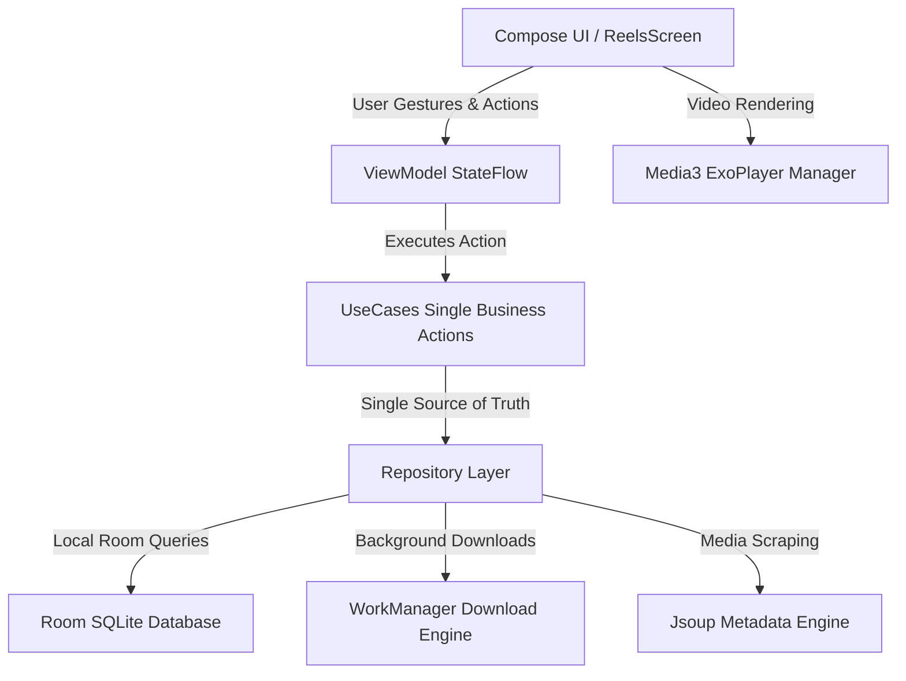

# LOOPLY

```
██╗      ██████╗  ██████╗ ██████╗ ██╗     ██╗   ██╗
██║     ██╔═══██╗██╔═══██╗██╔══██╗██║     ╚██╗ ██╔╝
██║     ██║   ██║██║   ██║██████╔╝██║      ╚████╔╝ 
██║     ██║   ██║██║   ██║██╔═══╝ ██║       ╚██╔╝  
███████╗╚██████╔╝╚██████╔╝██║     ███████╗   ██║   
╚══════╝ ╚═════╝  ╚═════╝ ╚═╝     ╚══════╝   ╚═╝   
```

<p align="center">
  <b>The Calm, Offline-First Instagram Reel Player & Organizer for Android</b><br>
  <i>Frictionless saving, instant looping playback, dynamic ambient glow, creator grouping, and pure Jetpack Compose Material 3.</i>
</p>

<p align="center">
  
  
  
  
  
  
  
  
  
  
  
</p>

---

## 📖 Overview

**Looply** by **Amurot** is a modern, calm, offline-first Instagram Reel player and organizer built for speed, tactile fluidity, and distraction-free viewing.

Instead of fighting distracting algorithms, ad-choked social feeds, and bloated cloud sync platforms, Looply embraces an **ephemeral watch-and-delete philosophy**. Share any reel directly from Instagram or paste a link from your clipboard, and Looply immediately fetches high-resolution video streams for instant, offline playback with zero buffering.

```
⚡ Quick-Paste / Share ➔ 🔄 Instant Looping ➔ 📁 Creator Collections ➔ 🗑️ Ephemeral Cleanup
```

---

## ✨ Key Features

| Feature | Description |
| :--- | :--- |
| 🔒 **100% Offline-First & Private** | Zero telemetry, zero analytics tracking, and zero account requirements. Downloaded reels and thumbnails reside securely in app-private device storage. |
| 🔄 **Media3 ExoPlayer Looping** | Instant playback engine with continuous looping (`REPEAT_MODE_ONE`), progressive caching, and an optional auto-advance mode for hands-free viewing. |
| ⚡ **1-Tap Quick Clipboard Download** | Tap the paste button to instantly detect copied Instagram reel links and queue downloads immediately without tedious dialog confirmations. |
| 💡 **Dynamic Ambient Glow** | Smooth YouTube-style diffuse glow softly bleeding reel colors into letterbox black bars, downsampled for buttery 60 FPS scrolling with zero GPU lag. |
| ⏩ **Touch-and-Hold 2X Speed** | Press and hold anywhere on the player to dynamically fast-forward playback at 2.0X speed with a neon visual pill indicator, reverting on release. |
| 📁 **Automatic Creator Grouping** | Smart aggregation automatically organizes saved reels by creator handle with instant filter chips and creator-focused video grids. |
| 🔍 **Smart Filters & Multi-Sorting** | Effortlessly filter by *All*, *Liked*, *Unwatched*, and *Watched*, and sort by *Recently Added*, *Duration*, *Most Viewed*, and *Least Viewed*. |
| 🗂️ **Multi-Select & Bulk Actions** | Long-press to activate multi-select mode: batch-export multiple reels directly to your device's public Gallery or bulk-delete to reclaim storage. |
| 📳 **Pure Tactile Haptics** | Fine-tuned vibrational feedback via `HapticsManager` on favorites, deletes, seeks, and navigation (strictly zero annoying audio beeps). |
| 🗜️ **Ultra-Compact 13 MB Footprint** | R8 whole-program optimization, resource shrinking, and locale stripping reducing APK size by over 77% while protecting SQLite integrity. |
| 🧹 **Watch-and-Delete Storage Management** | Ephemeral storage dashboard with a visual progress bar, 24-hour auto-prune, single-tap watched cleaner, and safety-prompted delete all actions. |

---

## 🏗️ Architecture & Tech Stack

Looply is built on modern Android engineering principles following **Clean Architecture** with a strict unidirectional data flow:



### **Core Libraries & Frameworks**
- **UI Framework**: 100% Jetpack Compose with Material 3 Design Tokens
- **Design System**: Linkerly Design System (`LinkerlyCard`, `LinkerlyButton`, `LinkerlyIcons`)
- **Architecture**: MVVM + UseCase + Repository Pattern
- **Dependency Injection**: Dagger Hilt (`@HiltViewModel`, `@Inject`, `@Module`)
- **Video Playback**: AndroidX Media3 (ExoPlayer) with `SimpleCache` preloading
- **Background Jobs**: AndroidX WorkManager for resilient foreground downloads
- **Local Persistence**: Room SQLite with strict non-destructive migrations (`MIGRATION_1_TO_2`, `MIGRATION_2_TO_3`)
- **Image Loading**: Coil 3 with bitmap downsampling for fast ambient blur
- **HTML Parsing**: Jsoup for robust metadata extraction
- **Haptic Engine**: Custom `HapticsManager` with device vibrator composition

---

## 📂 Project Structure

```
com.arjunaayush.looply/
├── core/
│   ├── database/       # Room Entities (VideoEntity, PendingReelEntity), DAOs, VideoDatabase, Migrations
│   ├── designsystem/   # Linkerly Theme, LinkerlyCard, LinkerlyButton, LinkerlyIcons, NavigationBar
│   ├── network/        # Instagram Scraper, Jsoup Metadata Engine, WebView Reel Source
│   ├── player/         # Media3 ExoPlayer Manager, SimpleCache, Preload
│   ├── preferences/    # SharedPreferences PreferencesManager (Haptics, Loops, Ambient Mode)
│   └── util/           # HapticsManager, MediaExportUtils, ShakeDetector, StorageUtils
├── data/
│   ├── local/          # Local Data Sources & Storage Helpers
│   └── repository/     # VideoRepository Implementation (Database, Filesystem, WorkManager)
├── domain/
│   ├── model/          # Pure Domain Models (Video, CreatorGroup, ReelSmartFilter, ReelSortOrder)
│   ├── repository/     # VideoRepository Interface
│   └── usecase/        # DownloadReelUseCase, DeleteVideoUseCase, DeleteAllVideosUseCase, etc.
├── feature/
│   ├── feed/           # Full-screen VerticalPager reel player feed, 2X speed gesture, ambient blur
│   ├── saved/          # Saved video grid, multi-select bulk actions, creator filter row, storage header
│   ├── settings/       # Playback defaults, storage manager, collapsible live ingestion console
│   └── receiver/       # Transparent ShareReceiverActivity for instant Android Share Sheet import
└── features/
    └── download/       # ReelIngestionEngine, IngestionGuard, DownloadReelWorker, AutoDownloadWorker
```

---

## 🚀 Getting Started & Local Build

### Prerequisites
- **Android Studio Ladybug (2024.2+)** or newer
- **JDK 17** or **JDK 21**
- **Android SDK Platform 37** installed (Min SDK: 28)

### Clone and Compile
```bash
# Clone the repository
git clone https://github.com/Arjunaayush/Looply.git
cd Looply

# Run unit tests across Direct and Play flavors
./gradlew testDirectDebugUnitTest testPlayDebugUnitTest

# Assemble Direct Debug APK (Full background feed ingestion enabled)
./gradlew assembleDirectDebug

# Assemble Minified Direct Release APK (~13 MB)
./gradlew assembleDirectRelease

# Assemble Minified Play Release APK (Play Store compliant)
./gradlew assemblePlayRelease
```

Output APKs will be located at:
```
app/build/outputs/apk/direct/release/app-direct-release-unsigned.apk
app/build/outputs/apk/play/release/app-play-release-unsigned.apk
```

---

## 📦 Build Flavors

| Flavor | Target Channel | Feed Ingestion Engine | Play Store Safe |
| :--- | :--- | :--- | :--- |
| `direct` | Sideload / GitHub Releases | **Full WebView ingestion & parallel background crawler** | Sideload only |
| `play` | Google Play Store | **Share sheet and direct URL import only** | Yes (Play Store compliant) |

---

## 📜 Documentation

- 🏛️ [`docs/ARCHITECTURE.md`](docs/ARCHITECTURE.md) — Architectural overview, data pipeline, and database migrations.
- ✨ [`FEATURES.md`](FEATURES.md) — Complete product features matrix and user experience design.
- 🎨 [`docs/POLISH_AND_ANIMATIONS.md`](docs/POLISH_AND_ANIMATIONS.md) — Motion design, spring physics, and ambient mode specs.
- 🧪 [`docs/TESTS.md`](docs/TESTS.md) — Unit testing guidelines, MockK suites, and test coverage.
- 🔒 [`docs/PRIVACY.md`](docs/PRIVACY.md) — Offline-first local data privacy policy.
- 📋 [`docs/TERMS.md`](docs/TERMS.md) — Terms of service.
- 🤖 [`AGENTS.md`](AGENTS.md) — AI engineering principles, coding rules, and design system constraints.

---

## 🛡️ License & Credits

- Looply application code is licensed under the [MIT License](LICENSE).
- All **Linkerly Design System** components, icons, and styling are proprietary assets of **Bhaskar Patel** and **Amurot** and subject to [`LICENSE_LINKERLY.md`](LICENSE_LINKERLY.md).

Developed with ❤️ by **Amurot**.
