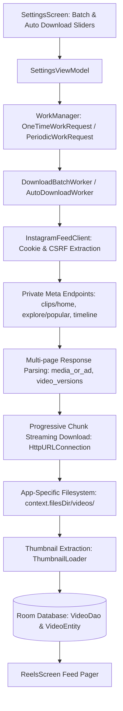

# Looply - Batch Reel Downloading Technical Dossier & TODO

> **Audience**: AI Software Engineering Agents & Senior Android Engineers  
> **Topic**: Instagram Algorithmic Reel Batch Ingestion, Pagination Architecture, Anti-Bot Protections & Production Roadmap  
> **Status**: In-Progress / Functional Prototype with Edge-Case Fragility

---

## 1. Executive Summary

Looply features a background **Batch Downloading Engine** and **WiFi Auto-Downloader** designed to fetch and cache videos directly from the user's authentic Instagram algorithmic feed (`instagram.com/reels`) into local Room storage for instant, offline, distraction-free looping.

While single-reel imports (via Share Sheet / URL) operate deterministically, **automated bulk algorithm ingestion** interacts directly with Meta's private, undocumented internal endpoints. This document details the exact mechanics, failure modes, reverse-engineering nuances, and recommended architectural enhancements for subsequent agents working on this system.

---

## 2. Architecture Overview



### Core Components
1. **[`SettingsViewModel.kt`](file:///Users/bhaskar/Coding/Projects/looply/app/src/main/java/com/arjunaayush/looply/feature/settings/SettingsViewModel.kt)**: Observes `WorkInfo` flows for both `DownloadBatchWorker.UNIQUE_WORK_NAME` and `AutoDownloadWorker.TAG`. Dispatches cancellations and progress updates.
2. **[`DownloadBatchWorker.kt`](file:///Users/bhaskar/Coding/Projects/looply/app/src/main/java/com/arjunaayush/looply/features/download/DownloadBatchWorker.kt)**: Coroutine foreground worker executing under `FOREGROUND_SERVICE_TYPE_DATA_SYNC`. Provides ongoing notification with progress bars and a native `createCancelPendingIntent` "Stop" action.
3. **[`AutoDownloadWorker.kt`](file:///Users/bhaskar/Coding/Projects/looply/app/src/main/java/com/arjunaayush/looply/features/download/AutoDownloadWorker.kt)**: Background worker scheduled with `NetworkType.UNMETERED` (WiFi) and `BatteryNotLow` constraints. Manages cache limits (300 MB - 5 GB) and 24-hour auto-deletion of watched loops.
4. **[`InstagramFeedClient.kt`](file:///Users/bhaskar/Coding/Projects/looply/app/src/main/java/com/arjunaayush/looply/core/network/InstagramFeedClient.kt)**: HTTP client responsible for session cookie aggregation (`PreferencesManager` + `CookieManager`), CSRF extraction, multi-page pagination, and response normalization.
5. **[`VideoRepository.kt`](file:///Users/bhaskar/Coding/Projects/looply/app/src/main/java/com/arjunaayush/looply/data/repository/VideoRepository.kt)**: Room database gatekeeper and duplicate filter (`isVideoAlreadyDownloaded(shortcode)`).

---

## 3. The Core Technical Challenges & Root Causes

### 3.1. Meta Private API Volatility & Schema Polymorphism
- **Endpoint**: `POST https://www.instagram.com/api/v1/clips/home/` with `container_module=clips_viewer_clips_tab`.
- **Payload Variance**: Meta does not serve a static JSON schema. An item in the returned `items` array can be shaped as:
  - `{"media": { ... }}`
  - `{"media_or_ad": { ... }}` (commonly used for sponsored and algorithmic interstitials)
  - `{"clip": {"media": { ... }}}`
  - `{"item": { ... }}`
  - Or a raw media JSON dictionary directly at the item index.
- **Impact**: Earlier revisions of the parser only inspected `optJSONObject("media")`. When Instagram returned `media_or_ad` or `clip`, the parser skipped 90% of candidate items, causing a 15-item batch to yield only 1 or 2 parseable videos.

### 3.2. Pagination Cursor Shifts (`max_id` vs `paging_token` vs Item PK)
- Meta's pagination markers move depending on whether the account is served by mobile API or web API endpoints:
  - `root.optString("max_id")`
  - `root.optString("next_max_id")`
  - `root.optJSONObject("paging_info")?.optString("max_id")`
  - `root.optJSONObject("pagination")?.optString("next_max_id")`
  - `root.optString("paging_token")`
- **The Empty Pagination Trap**: If the cursor is not found, page 2 sends the initial request without `max_id`. Meta's edge servers then return the exact same initial items. The repository checks `isVideoAlreadyDownloaded(shortcode)`, finds that all items are duplicates, and stops the worker with `"No more unique reels available from feed"`.
- **Current Mitigation**: Fallback cursor extraction resolves `max_id` from the last item's `pk` (`items.optJSONObject(items.length() - 1)`), and `persistentClipsMaxId` retains state across queue refills.

### 3.3. Meta Anti-Bot, WAF & TLS Fingerprinting
- **Headers Required**:
  ```http
  User-Agent: Mozilla/5.0 (Windows NT 10.0; Win64; x64) AppleWebKit/537.36 (KHTML, like Gecko) Chrome/128.0.0.0 Safari/537.36
  Cookie: sessionid=...; ds_user_id=...; csrftoken=...; mid=...
  X-IG-App-ID: 936619743392459
  X-ASBD-ID: 359341
  X-IG-WWW-Claim: 0
  X-CSRFToken: <token>
  X-Requested-With: XMLHttpRequest
  Origin: https://www.instagram.com
  Referer: https://www.instagram.com/reels/
  ```
- **Detection Vectors**:
  - Requesting pages faster than a human swipe rate triggers rate limits (`HTTP 429`) or temporary IP challenges.
  - Using Android's default `HttpURLConnection` without browser-like TLS extension negotiation (BoringSSL JA3 fingerprints) can trigger silent payload truncation or empty responses from Cloudflare/Meta edge proxies.

### 3.4. Video Stream Extraction: Progressive MP4 vs DASH manifests
- In standard reels, `video_versions` provides progressive `.mp4` URLs with pre-muxed AAC audio and H.264 video.
- For high-bitrate or newer clips, Instagram often omits `video_versions` or only provides `video_dash_manifest` (MPD XML). In DASH streams, video tracks and audio tracks are split into separate URLs and require client-side muxing.

---

## 4. Production Engineering Roadmap & Next Steps

When continuing development on the bulk downloading infrastructure, implement the following prioritized enhancements:

### High Priority: Headless WebView Network Interception Bridge
Instead of issuing raw HTTP requests via `HttpURLConnection`, leverage the already authenticated `WebView`:
1. Spin up a hidden background `WebView` using the user's active session.
2. Navigate to `https://www.instagram.com/reels/`.
3. Inject a JavaScript hook or override `window.fetch` / `XMLHttpRequest.prototype.open` to intercept the reel JSON responses that Instagram's own web app receives.
4. Bridge the captured media objects back to Kotlin via `@JavascriptInterface`.
- **Advantage**: 100% indistinguishable from a legitimate user viewing reels; bypasses TLS fingerprinting, WAF blocks, and manual header maintenance.

### High Priority: Multi-Tiered Algorithmic Fallbacks
Expand `InstagramFeedClient.kt` fallback order:
1. `clips/home/` (Primary Reels algorithm with `container_module=clips_viewer_clips_tab`)
2. `clips/home/` (Explore Reels with `container_module=clips_viewer_explore`)
3. `explore/popular/` (Explore popular media grid)
4. `feed/timeline/` (User timeline posts with `feed_view_mode=reels`)
5. GraphQL Query Protocol: Query hash for `ClipsViewerQuery` (`https://www.instagram.com/graphql/query/?query_hash=...`).

### Medium Priority: Media3 DASH Muxer Fallback
When a reel provides `video_dash_manifest` without a progressive `video_versions` MP4 URL:
- Use `androidx.media3.transformer.Transformer` to download the adaptive video and audio tracks and mux them into an `.mp4` container locally, rather than dropping the reel.

### Medium Priority: Adaptive Backoff & Exponential Jitter
- Add a 1.5s–3.5s randomized jitter between pagination requests in `DownloadBatchWorker.kt` to mimic authentic human swipe pacing and avoid rate-limiting triggers.

---

## 5. Key File Index

- [`InstagramFeedClient.kt`](file:///Users/bhaskar/Coding/Projects/looply/app/src/main/java/com/arjunaayush/looply/core/network/InstagramFeedClient.kt): Core API queries, pagination cursor management, JSON response parsers.
- [`DownloadBatchWorker.kt`](file:///Users/bhaskar/Coding/Projects/looply/app/src/main/java/com/arjunaayush/looply/features/download/DownloadBatchWorker.kt): Instant batch worker, foreground notification, streaming download loop.
- [`AutoDownloadWorker.kt`](file:///Users/bhaskar/Coding/Projects/looply/app/src/main/java/com/arjunaayush/looply/features/download/AutoDownloadWorker.kt): Background periodic WiFi auto-downloader and cache pruning.
- [`SettingsViewModel.kt`](file:///Users/bhaskar/Coding/Projects/looply/app/src/main/java/com/arjunaayush/looply/feature/settings/SettingsViewModel.kt): WorkManager dispatch, progress observation, cancel routines.
- [`VideoRepository.kt`](file:///Users/bhaskar/Coding/Projects/looply/app/src/main/java/com/arjunaayush/looply/data/repository/VideoRepository.kt): Room DB entity persistence, deduplication queries.
